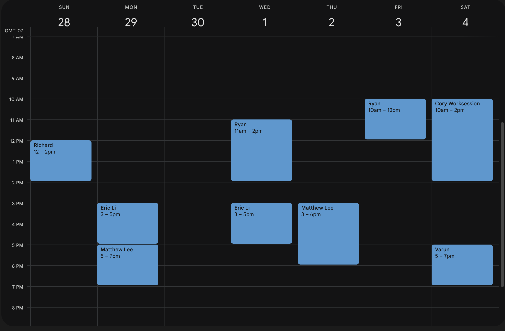

# Section 1: Introduction to Hardware Lab

Welcome to the CalSol Electrical subteam! To ensure everybody starts off on the same page, we ask that you complete this training.

For this training, you are going to be designing a PCB that can create PWM waves (don't worry if you don't know what this is!). This lab is going to have a major emphasis on PCB layout (with schematic emphasized in lecture slides), so although the schematic (circuit drawing) will be given to you, you will be designing your own layout. 

### Here is a lab walkthrough video:

[Walkthrough Video](https://www.youtube.com/watch?v=7nmz1k9MV_c) (feel free to watch at faster speed)

### Here is a general overview of the hardware training:
- [Section 2](./Section2.md) is an overview of basic electrical concepts you will learn in the class EECS 16B. If you have already taken this class or another circuit class, feel free to take a look over the document as a refresher.
- [Section 3](./Section3.md) introduces KiCad, which is the software we will be using to design schematics and PCBs. This section focuses on the schematics portion of KiCad.
- [Section 4](./Section4.md) goes over key concepts in a motor controller such as PWM, MOSFETs, and 555 timers.
- [Section 5](./Section5.md) goes over the PCB layout portion of KiCad.
- [Section 6](./Section6.md) is the bring-up (hands-on) portion of the training.

## Deadline for new members (Wednesday, October 1st at 9 am)
The hardware lab component must be finished the morning of the 1st as all CalSol onboarding must be checked off and confirmed by GM later that day. Note that the last office hours and chance for help will be the last day of September (9/30). 

# OFFICE HOUR TIMES
In-person Office hours for help and checkoffs. 
## All Office hours will be held in or outside Cory 246 (Supernode)
- If you cannot enter the building call the office hour staff (numbers are on Slack profiles)

Ignore the date. This is the timeline daily for the whole two weeks of onboarding unless further clarified.

Feel free to reach out to the lab staff on slack for help or for checkoffs:
- Matthew Lee
- Eric Li
- Richard Gomez
- Ryan Kwong
- Alex Wong
- Haaziq Kazi
- Yingqi Yang
- Varun Datta
- Janus Sucharitakul

