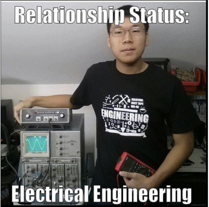

# Fa25 Firmware Lab: Button + Potentiometer LED Control

Welcome to your first firmware project! 🎉  
In this lab, you’ll learn how to connect simple input devices (a **button** and a **potentiometer**) to an **ESP32** and use code to control an **LED**.  
This project introduces **GPIO basics**, **analog inputs**, and **PWM duty cycle control**, which are essential skills for future work on the solar car.

---

## 🧾 Deliverables
- LED toggles on/off with button press (includes software debouncing).  
- LED brightness responds smoothly to potentiometer when active.  
- Serial Monitor prints `"LED ON/OFF"` messages.  
- Screenshot or video demo of working circuit in **Wokwi**.  

---

## ⚙️ Circuit Setup

1. Go to [https://wokwi.com/](https://wokwi.com/) → Select **ESP32** → Scroll down for **Starter Templates** → Select **ESP32** (the very first one).
3. When you open a new project, you’ll see something like this:

   - For now, ignore the left half (code editor).  
   - Let’s first make our circuit on the right half.  

### Toolbar Overview
- ▶️ **Run** – compiles and runs your code.  
- 🧩 **Add Part** – adds circuit components.  
- 🧱 **Workspace Tools** – affects only layout/view; safe to explore.  

---

## 🧰 Parts for This Lab

- **ESP32 Board** – our “mini-computer.” It runs your code and controls the rest of the circuit.  
- **LED (Light Emitting Diode)** – output device that lights up, dims, or turns off depending on the firmware.  
- **Resistor** – protects the LED from excess current (use 220–330 Ω).  
- **Push Button** – input device; pressing it sends a signal to toggle the LED.  
- **Potentiometer (variable resistor)** – input device; turning the knob adjusts the LED’s brightness.  
- **Wires** – connect all the components to allow current and signals to flow.

---

## 🧩 To-Do

Use the **Add Part** button to add:
- 1 × LED  
- 1 × Resistor (220–330 Ω recommended)  
- 1 × Push Button  
- 1 × Potentiometer
For your reference:

Once all parts are placed on the canvas, we’ll move on to wiring them together.  

*(Don’t worry — we’ll go step by step!)*

---
## 🔗 Connecting the Circuit

### LED + Resistor
- Long leg (anode) → through **220 Ω resistor** → **GPIO 15** on ESP32.  
- Short leg (cathode) → **GND**.  

> **Why:** GPIO 15 is a general-purpose digital output. The resistor ensures the LED doesn’t burn out.

---
### Push Button
- One side → **GPIO 4**.  
- Other side → **GND**.  

> ⚠️ **Important:** Connect the **diagonal pins**; otherwise you’re shorting the button!  
> **Why:** GPIO 4 reads **LOW** when pressed (connected to GND) and **HIGH** when released, thanks to the internal pull-up.

---
### Potentiometer
- Middle pin → **GPIO 34** (analog input).  
- One outer pin → **3.3 V**.  
- Other outer pin → **GND**.  

> **Why:** GPIO 34 is an ADC pin that reads a range of values (0–4095) representing the potentiometer’s position.

---

### Power & Ground
Make sure **all components share the same 3.3 V and GND** connections.  

> Without a common reference, current won’t flow and the ESP32 can’t control or sense components.

---

When finished, your circuit should look similar to this (feel free to make it look neater!):  

# Actual Firmware Stuff :)

Okay, the circuit’s all hooked up — now let’s sprinkle some code magic on it!

---

On the left half of your screen, you should see two important functions:

1. setup()

   - Runs once at the very beginning.
   - Think of it like *“initialization.”*  
     This is where you configure pins, start communication, or print a startup message.
   - Example here:  
     Serial.begin(115200) -> sets up the USB serial connection so the ESP32 can talk to your computer.

2. loop()

   - Runs over and over forever.
   - This is where your main program logic lives.  
     If you want the ESP32 to blink an LED, read a button, or check a sensor, that code will go here.

---

In this starter code, the only thing inside loop() is a short delay(10);. That doesn’t do much, but it prevents the simulation from running unnecessarily fast.

In this lab, our firmware has **two main jobs**:

1. **Read the button (pin 4)** → Every time you press it, it should toggle the LED between “active” (responding to the potentiometer) and “off.”  
   Basically, the button acts like an on/off switch for PWM control.

2. **Read the potentiometer (pin 34)** → The potentiometer gives us an analog value (0–4095).  
   We’ll map that value into a brightness level (0–255).  
   Turning the knob = changing how bright the LED shines.

3. **Control the LED (pin 15)** → The LED should only light up if the button has enabled it,  
   and its brightness should scale smoothly based on the potentiometer value.

---

### Big Picture Functionality

- Press the button once → LED listens to the potentiometer.  
- Press again → LED ignores the potentiometer and stays off.  
- Twist the knob → LED brightness goes up and down like a dimmer.

# Time to Code!

Now that we know *what* the firmware should do, let’s start building it piece by piece.  
Don’t worry, we’ll go step-by-step — but you’ll also get chances to figure things out yourself.

---

### 1. Setup the pins

- Define which pins we’ll use (LED on 15, Button on 4, Potentiometer on 34).  
  1. Think of what additional variables you may need for the LED and button, specifically debouncing.
- In setup(), tell the ESP32 whether each pin is an input or output.  
  **Hint:** The LED should be OUTPUT, the button should be INPUT_PULLUP.  
  Can you guess why?

### 2. Read the button (with debouncing)

- Try writing code to check if the button is pressed.
- What logic level (HIGH or LOW) will you see when it’s pressed?
- Recap on debouncing: sometimes one press = multiple signals (because of mechanical *bouncing*).

Add a simple **debounce** using millis():

- Remember the last time the button was pressed.
- Only accept a new press if enough time (e.g., 150 ms) has passed.
- millis(): this is a built-in Arduino function that returns the number of milliseconds that have passed since your ESP32 started running the current program.

**Bonus:** Add a toggle (pressed once = ON, pressed again = OFF).

### 3. Read the potentiometer and map the value

- Use analogRead(POT_PIN) to see what values you get when turning the knob.  
  Print these values to Serial Monitor.  
  What’s the range? *(Spoiler: ~0–4095).*
- We want to turn those big numbers into something useful for LED brightness.  
  Use the map() function to scale 0–4095 → 0–255.
hint: map(value, fromLow, fromHigh, toLow, toHigh)

### 4. Drive the LED

- Finally, send the mapped value to the LED.  
  Use： analogWrite(LED_PIN, duty);
- If the button has turned the LED “off,” then don’t write anything except 0.

### 🧠 Sanity Check (Before Getting Checked Off)

Here is what is supposed to happen when you run the code:

1. The **LED will initially be OFF**, waiting for a button press.

2. Press the **button once** to turn the LED **ON** — now the LED will respond to the **potentiometer**.  
   - **Twist the potentiometer** to change the LED’s brightness smoothly.

3. Press the **button again** to turn the LED **OFF**, no matter the potentiometer position.

4. The **Serial Monitor** will show:
   - "LED ON" when the button enables the LED.
   - "LED OFF" when the button disables the LED.

### 💡 Pro-tip

If the LED doesn’t change brightness or the button doesn’t work, check your wiring carefully — especially the button’s connection to **GND**.

**IMPORTANT: Upon finishing the project, please reach out to lab staff for check off.

---

## 🎉 Congratulations!

You have now **completed the entire onboarding process!**

