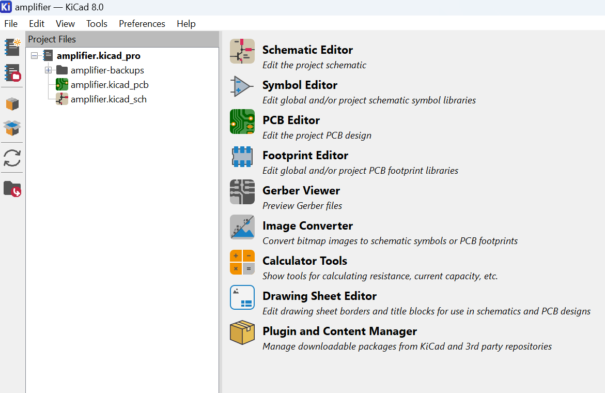
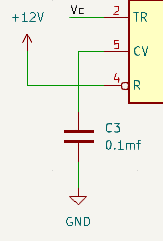
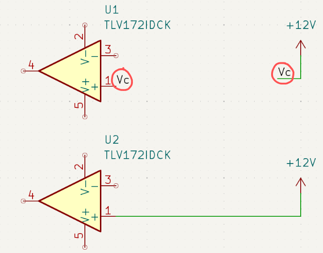
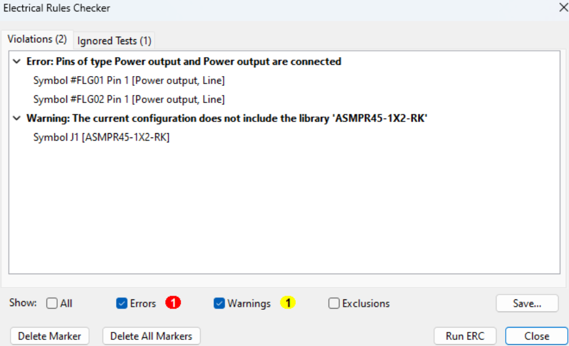
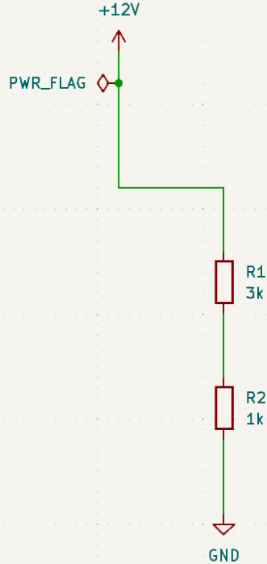

# Section 3: KiCad Schematic

### Setting up the Software

KiCad is the software we use to design schematics and PCB layouts. If you don't have the software already, install it [here](https://www.kicad.org/download/). Once it is installed, launch it. If everything is installed correctly, it should look something like this:

We are going to want to create a new project. To do so go to `File` &#8594; `New Project`. Name your file and then save it. The project files tab should now have your file names (e.g. `your_file_name.kicad_pcb`, `your_file_name.kicad_sch`). The only two tools we are concerned with are the Schematic Editor and the PCB Editor. For now, we will focus on the Schematic Editor and come back to the PCB editor after we have finished our schematic.

### Tips for Desigining Schematics

As a reminder, the schematic is the digital model for how your circuits will look after you assemble it.

#### Hotkeys:
- `W` for 'W'ires: these are just like any wire in a real circuit - they move power from the power source to the various components and to ground
- `L` for 'L'abels: labels connect different parts of the circuit without needing a physical connection. If you place the same label on two open wires, KiCad will consider them connected.
- `A` for 'A'dd symbols: symbols are the meat of the schematic. Each symbol represents a component in the circuit (ex: diode, resistor, battery, etc)
- `R` for 'R'otation: if you ever need to rotate a symbol while placing it, press R until you find the right configuration

#### Symbol Placement:
- Power and ground: In general, try to always keep your power source pointing upwards and your ground pointing downwards. Move from higher potential to lower potential
 
 - Signals (wires not related to power): try to have signals move from left to right (like reading a book). If you have an IC with an input and output signal, try to keep the input on the left and the output on the right
 - Modular Design: try to keep different subsections of your circuit in separate areas as you design it. This makes it a lot easier to read and will help immensely as you design your PCB. Here is an example circuit.
 
 - Labeling: labels make your schematic look a lot cleaner, so labeling as you go will make your work much easier 

 

 #### Power Flags
 When you make any schematic, you’ll have to define where the power is coming from. In your schematic, you’ll mark this with some power label (ex: +12V). To us, it’s pretty obvious that this is where power is coming from, but KiCad is kind of stupid, so you’ll have to attach a power flag to the same wire to tell it that’s where power is coming from. The good news is that you’ll only have to do this once, since it’s implied that all power labels (of the same voltage) are connected. 

 #### ERC
 When you’re finally done laying out your schematic, you’ll have to run ERC (electrical rules checker). At the top of your page, find this symbol  and press it. Click Run ERC and KiCad will validate whether or not your circuit is electrically viable (no shorted circuits, all wires are connected, etc). Once ERC is finished, you’ll see a page similar to this one.

 

 Errors are fatal mistakes that compromise the integrity of your circuit. Clicking on the error will bring you to the source of the error on your schematic. It will also be marked by a red arrow on the schematic. You can ignore warnings, but for this lab, you CANNOT ignore errors. Once you have 0 errors, you’re good to move on to PCB design! Congrats!

 ### Exercise: LED Circuits

 You are tasked with designing a circuit to power some Leds and here are the following circuit requirements/constraints you are given:

- Three LEDs
  - that has a 3V drop
  - Needs roughly 20 mA 
 
 - A 12V power source 

 Think about how you would accomplish this!

 #### Naive Approach

 Let’s imagine that you want to use the voltage divider we learned about in Section 2 to meet the 3V requirement for a signal LED. Start by constructing a voltage divider: 

 

 Verify that the resistor values are correct. Then connect your LED in parallel with R2

 

 What you would notice if you actually made this circuit in real life is that the LED is much dimmer than it is supposed to be; it’s not a great way to create a simple LED circuit! Take a moment to think about the drawbacks of this circuit and why we might not want to use it to power our LED (even if you didn’t think of this solution, imagine explaining why this circuit is not ideal to another student!)

 > Answer: this circuit assumes that the LED has no internal resistance. However, we know from the fact that it has a 3V drop that it in fact does. This means that, when we add our LED to the voltage divider, we are essentially adding the LED and R2 in parallel, lowering the equivalent resistance. Therefore, if we recalculate the voltage drop across the LED, we’ll find that it’s actually lower than 3V, making the LED dimmer than it should be. Another way of thinking about this is that we are assuming that no current flows through the LED which, in reality, is not the case.

 ### Practice 

Using the same circuit requirements as the exercise, create:
1. A simple circuit that powers the LED. (Hint: use only one resistor!)
2. A circuit with the ability to control the brightness of the LED (use a potentiometer!)

You’re all set to move on to the motor controller! [Here’s](https://www.youtube.com/watch?v=UPTU6nYSaMo&t=874s&ab_channel=TheEngineeringMindset) a helpful video to get you started on your schematic design.
