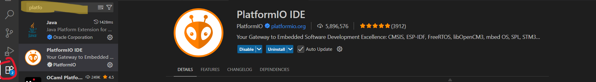

# Section 8: Software Introduction

## Git + Github Repositories

This is what we use to share files and practice version control

### Setting up Git

Create a github account if you don't already [here](https://github.com/).

**Action Item**: fill out this form [here](WIP) with your email so we can add you to the club Github repository. (This is the same form from the lecture)

After you are added to the GitHub repository, we need to add the repositories to your computer. We advise the use of Github desktop to make this process easier. Here is a link to install [here](https://desktop.github.com/download/). This lab will use github desktop, but if you are competent enough at regular Git doing it through Git Bash is an option

Here is a useful link from CS61B course staff to setup Git on your computer [here](https://sp25.datastructur.es/labs/lab01/windows/) if you want to use Git Bash

### Cloning Relevant Repositories

Now we will use GitHub desktop to explain how to clone the relevant repositories

WIP Add small tutorial to clone repos as well as note which repos to clone

### How CalSol uses Git

WIP Add a section on how we want to use version control and git to share. Explain the process we use on Git

## C and C++

### Installing VSCode, Platform.io, and C++

If you don't already have VSCode installed on your computer, install it using this link [here](https://code.visualstudio.com/download). Ignore if you already have VSCode installed

### Setting Up Platform.io

After you install VSCode, you can install platform.io through VSCode Extensions. Go to VSCode Extensions and download the PlatformIO IDE. To do this, click on the extensions area of the sidebar (shown in red on the image) and search up platformIO IDE (as highlighted)

### Running Platform.io

WIP Explain the process to run and upload code off of platform

## Confluence + Jira

WIP Explain what these softwares do and how we would like members to use it. Doubles as intro to Jira for everyone
