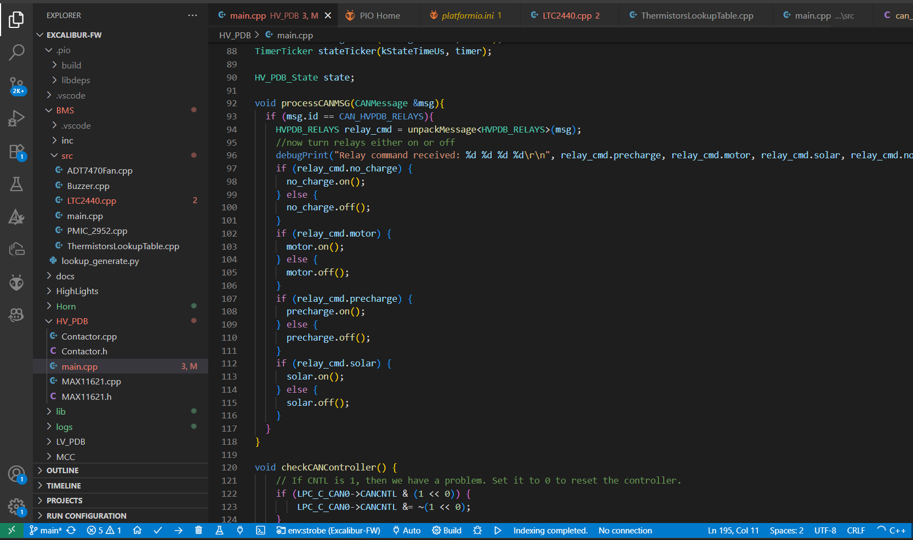

# Section 8: Software Introduction

Note: Please don't get stuck on this part of the firmware lab. We will help debug this software stuff in person. Please continue on without finishing this section as the following sections don't need any of this software.

## Git + Github Repositories

This is what we use to share files and practice version control

### Setting up Git

Create a github account if you don't already [here](https://github.com/).

**Action Item**: fill out this form [here](WIP) with your email so we can add you to the club Github repository. (This is the same form from the lecture)

After you are added to the GitHub repository, we need to add the repositories to your computer. We advise the use of Github desktop to make this process easier. Here is a link to install [here](https://desktop.github.com/download/). This lab will use github desktop, but if you are competent enough at regular Git doing it through Git Bash is an option

Here is a useful link from CS61B course staff to setup Git on your computer [here](https://sp25.datastructur.es/labs/lab01/windows/) if you want to use Git Bash

### Cloning Relevant Repositories

Now we will use GitHub desktop to explain how to clone the relevant repositories

WIP Add small tutorial to clone repos as well as note which repos to clone

### How CalSol uses Git

WIP Add a section on how we want to use version control and git to share. Explain the process we use on Git

## Programming a Board

### Installing VSCode, Platform.io, and C++

If you don't already have VSCode installed on your computer, install it using this link [here](https://code.visualstudio.com/download). Ignore if you already have VSCode installed

### Setting Up Platform.io

After you install VSCode, you can install platform.io through VSCode Extensions. Go to VSCode Extensions and download the PlatformIO IDE. To do this, click on the extensions area of the sidebar (shown in red on the image) and search up platformIO IDE (as highlighted)

### Running Platform.io

How do we run Platform.io?

First you can click on the platformIO symbol on the left side (it looks like an alien). Here it will prompt you to create a project or to open a folder to a project. Because I do not assume you have any projects or access to our projects, I will demonstrate me opening and running code. Please don't waste time trying to make a project, just refer back to this lab or us when the time comes.

When you open a project or folder, you will see c++ code. Note: when opening CalSol firmware library code, open the entire repo folder to have access to all relevant libraries. In this IDE you will actually be writing, debugging, and uploading this C++ code, so the only way to really learn it is to play around with it. Here is a picture of what your window will look like

At the bottom of the page contains most of the interesting things you will using in Platform. These include the buttons for build (check mark), upload (right arrow), and serial monitor (plug). You can also choose the environment you are actually uploading. Make sure you are in the correct environment to make sure you are uploading the correct code. In general, just play around with it and you will find it is more intuitive than you would think.

