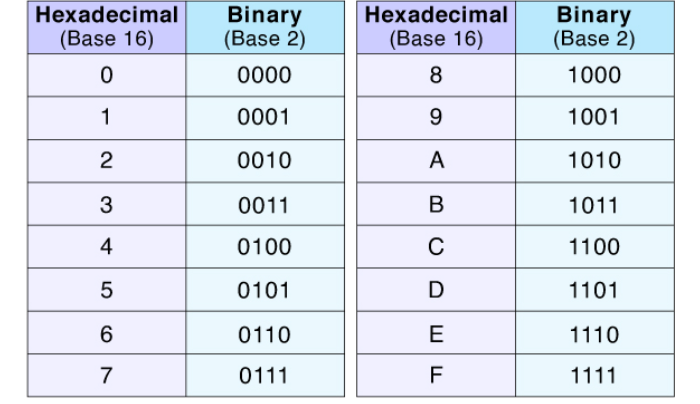

# Section 9: CS61C Done Fast

Note: if you already have taken or are taking 61C, this will be complete review.

## Syntax

Sadly, syntax is something you will have to get used to. For now we won't bother with teaching you guys C specific syntax, but here is a nice link with a list of C syntax. Link to [w3schools](https://www.w3schools.com/c/index.php) here.

## Number Representation

### Binary

We will be programming in C with numbers, but actual signals are sent as binary. Binary meaning either 1's and 0's. To understand binary, lets understand our base 10 system. When we have a base 10 number like 123, we are really doing quick math in our head of 1 * 100 + 2 * 10 + 3 * 1, or more specifically, 1 * 10^2 + 2 * 10^1 + 3 * 10^0. In base 10 each digit is some value from 0-9 multiplied by a power of 10 corresponding to its place in the number. Base 10 gets its name as each digit is a power of 10, and there are 10 possible symbols that can represent a digit (0 - 9). 

So what is binary? Binary is base 2. Base 2 means that each number is instead written in terms of 2 numbers (0 and 1), and each place is in terms of a power of 2. This means that if we have the number 0b101 (note that 0b lets us know the number is a binary number), it really corresponds to 1 * 2^2 + 0 * 2^1 + 1 * 2^0 = 5. This will take a while at first, but eventually you will get the hang of it. Note that the name binary refers

What if we want to convert our decimal values to binary. It is just the same thing just in reverse! To be succinct we won't explain in detail how to calculate these, but you can think through that a number like 20 would be 16 + 4, meaning in binary it would be 0b10100.

Why? Binary represents bits!!! When we send a digital signal, we are reading either a high value or a low value (think of the square wave from the PWM). These high and low values can be represented as a 1 for high and 0 for low.

### Hex

In reality, writing out a 64 bit message will be very hard to read and hard to fit on a page as we would need 64 digits (as each digit represents 1 bit). Instead, we can simplify it to represent things in Hex. Hex is base 16, so contains values from (0 - 9) as well as (A - F). Similar to binary, we can convert back and forth using powers of 16 multiplied by our different digits. For example 20 in hex is 0x14 (note 0x denotes a number is hex) as 1 * 16^1 + 4 * 16^0 is 20.

Why do we care about hex? Let's make some interesting observations. Note that 16 is a multiple of 2. This means it interfaces very easily with things defined in terms of multiples of 2. More specifically, 16 is 2^4. Without getting too in depth, I want you to believe me when I say that this means any singular hex digit (or any number between 0-15 for that matter) can be represented one to one by 4 binary digits. We have a table below of this

Even cooler, we can actually represent any 2 digit hex number with an 8 digit binary number. This is exactly because powers of 2 and powers of 16 line up, and you can think of the different digits as just being shifted by a multiplication of a power of 2 or 16. For the punchline, we realize that hex is effectively just a nicer way of reading binary, as we can get the value of any 4 bits by looking at a singular hex digit.

### Other things

It would be nice to teach you everything now, but for sake of time we won't. If you are more curious about all of this before 61C, you can look up topics such as Endianess and IEEE-754 Floating point as these happen to come up when dealing with firmware. 
